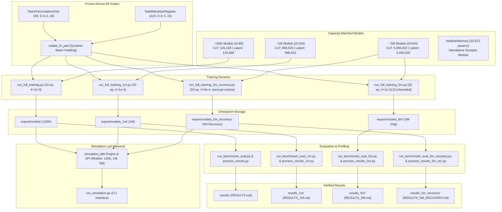

# System Architecture & Component Traceability

This document describes the multi-scale architecture as it **actually exists and executes** in the repository, establishing traceability between physical files, architectural modules, training checkpoints, and benchmark evaluations across the 126K, 1M, and 5M experimental scales.

---

## 1. System Architecture Overview

The repository consists of five core modular stages:
1. **Algorithmic State-Transition Data Generation**: `data_generator.py` (implementing permutation orbit traversal on $S_8$ and modular register arithmetic on $\mathbb{Z}_{10}$, identical and frozen across all scales).
2. **Capacity-Matched Reasoning Architectures**:
   - `models_cot_model.py`: Causal Transformer decoder (`AutoregressiveCoT`) scaled to 126K, 1M, and 5M.
   - `models_latent_model.py`: Structured memory cross-attention with GRUCell (`RecurrentLatentReasoner`) scaled to 126K, 1M, and 5M.
   - `models_hebbian_model.py`: Fast-weight outer-product synaptic plasticity (`HebbianMemory`, standalone).
3. **Multi-Scale Training & Checkpointing**:
   - 126K Baseline: `run_full_training.py` $\to$ `export/models/`
   - 1M Scaling: `run_full_training_1m.py` $\to$ `export/models_1m/`
   - 5M Original: `run_full_training_5m.py` $\to$ `export/models_5m/` [HISTORICAL / CONFOUNDED]
   - 5M Recovery: `run_full_training_5m_recovery.py` $\to$ `export/models_5m_recovery/` [CONTROLLED]
4. **Benchmarking, Hardware Profiling & Pareto Extraction**:
   - 126K Baseline: `run_benchmark_eval.py`, `process_benchmark_results.py` $\to$ `results/`
   - 1M Scaling: `run_benchmark_eval_1m.py`, `process_benchmark_results_1m.py` $\to$ `results_1m/`
   - 5M Original: `run_benchmark_eval_5m.py`, `process_benchmark_results_5m.py` $\to$ `results_5m/`
   - 5M Recovery: `run_benchmark_eval_5m_recovery.py`, `process_benchmark_results_5m_recovery.py` $\to$ `results_5m_recovery/`
5. **Interactive Simulation Lab Backend**:
   - `simulation_lab/`: Polymorphic service engine (`SimulationLabEngine`) providing programmatic simulation, trace capture, budget sweeps, and comparisons across all model scales.
   - `run_simulation.py`: Interactive command-line interface.

---

## 2. Detailed Component Breakdown

### 2.1 Data Generation (`data_generator.py`)
- **Status**: [VERIFIED] Fully implemented, tested, and frozen across all experiments.
- **Global Vocabulary ($V=24$)**:
  - Digits `0`..`9` $\to$ indices `0`..`9`
  - Operators: `OP_ADD=10`, `OP_MUL=11`, `OP_SUB=12`
  - Special tokens: `MAP=13`, `START=14`, `HOPS=15`, `THINK=16`, `END_THINK=17`, `ANS=18`, `PAD=19`, `EOS=20`
- **`TaskAPermutationOrbit`**: State-space $N=8$, $\pi \in S_8$, $v_0 \in \{0..7\}$, depth $D \sim \text{Uniform}(2, 16)$, trajectory $v_{t+1} = \pi(v_t)$.
- **`TaskBModularRegister`**: Register $r_0 \in \mathbb{Z}_{10}$, operations from $\{\text{OP\_ADD}, \text{OP\_MUL}, \text{OP\_SUB}\}$, operand constants $c \in \{1..9\}$, depth $D \sim \text{Uniform}(2, 16)$, transition $r_{t+1} = (r_t \circ c) \pmod{10}$.
- **`collate_fn_pad`**: Dynamically pads batches to the longest instance, returning tensor dictionaries with explicit attention masks and ground-truth trajectories.

---

### 2.2 Model Architectures Across Scales

#### A. `AutoregressiveCoT` (`models_cot_model.py`)
A causal Transformer decoder that generates intermediate reasoning scratchpad tokens sequentially:
- **126K Baseline**: $d_{\text{model}}=80, \text{nhead}=4, L=2, d_{\text{ff}}=192 \implies \mathbf{126,168}$ parameters.
- **1M Scaling**: $d_{\text{model}}=224, \text{nhead}=4, L=2, d_{\text{ff}}=624 \implies \mathbf{998,520}$ parameters.
- **5M Scaling**: $d_{\text{model}}=544, \text{nhead}=4, L=2, d_{\text{ff}}=1168 \implies \mathbf{5,000,632}$ parameters.
- **Inference Mechanism (`generate`)**: Greedily predicts tokens up to budget $k$ or until `END_THINK` is emitted, then emits `ANS` and predicts the answer.

#### B. `RecurrentLatentReasoner` (`models_latent_model.py`)
A recurrent architecture updating continuous hidden states through cross-attention to input memory followed by a GRUCell:
- **126K Baseline**: $d_{\text{model}}=80, \text{nhead}=4, d_{\text{ff}}=304 \implies \mathbf{125,688}$ parameters ($\Delta = -0.38\%$).
- **1M Scaling**: $d_{\text{model}}=224, \text{nhead}=4, d_{\text{ff}}=1027 \implies \mathbf{998,523}$ parameters ($\Delta = +3$ params).
- **5M Scaling**: $d_{\text{model}}=544, \text{nhead}=4, d_{\text{ff}}=1795 \implies \mathbf{5,000,635}$ parameters ($\Delta = +3$ params).
- **Inference Mechanism (`infer`)**: Executes fixed exact $k$ recurrent transitions. Does not implement adaptive halting.

#### C. `HebbianMemory` (`models_hebbian_model.py`)
Standalone fast-weight synaptic plasticity module using outer-product updates:
- Trainable parameters: $12,480$ (encoder $64 \to 128$, decoder $64 \to 64$).
- Registered non-trainable state elements: $8,192$ ($\sigma \in \mathbb{R}^{128 \times 64}$).
- Total parameters/state: **20,672**. Standalone component; not part of the multi-seed benchmark.

---

### 2.3 Training Runners & Checkpointing

| Scale | Runner Script | Optimization Protocol | Checkpoint Output |
| :--- | :--- | :--- | :--- |
| **126K Baseline** | `run_full_training.py` | 20 epochs, batch 32, AdamW, $\text{lr}=10^{-3}$, grad clip 1.0 | `export/models/` (20 checkpoints) |
| **1M Scaling** | `run_full_training_1m.py` | 20 epochs, batch 32, AdamW, $\text{lr}=10^{-3}$, grad clip 1.0 | `export/models_1m/` (20 checkpoints) |
| **5M Original** | `run_full_training_5m.py` | 20 epochs, batch 32, AdamW, $\text{lr}=10^{-3}$, grad clip 1.0 *(Confounded)* | `export/models_5m/` (20 checkpoints) |
| **5M Recovery** | `run_full_training_5m_recovery.py` | 50 epochs, batch 32, AdamW, $\text{lr}=5 \times 10^{-4}$, 5 ep warmup, cosine decay to $10^{-5}$, grad clip 1.0 | `export/models_5m_recovery/` (20 checkpoints) |

---

### 2.4 Benchmark & Analysis Layer

Each scale has dedicated evaluation and post-processing scripts that write strictly to isolated results directories:
- **126K**: `run_benchmark_eval.py` $\to$ `process_benchmark_results.py` $\to$ `results/`
- **1M**: `run_benchmark_eval_1m.py` $\to$ `process_benchmark_results_1m.py` $\to$ `results_1m/`
- **5M Original**: `run_benchmark_eval_5m.py` $\to$ `process_benchmark_results_5m.py` $\to$ `results_5m/`
- **5M Recovery**: `run_benchmark_eval_5m_recovery.py` $\to$ `process_benchmark_results_5m_recovery.py` $\to$ `results_5m_recovery/`

Every evaluation tests 1,000 deterministic test instances (seed 999) across budgets $k \in \{1, 2, 4, 8, 12, 16\}$, producing 120 raw records per scale.

---

### 2.5 Simulation Lab Backend Engine (`simulation_lab/`)
A unified programmatic backend layer implementing:
- `SimulationLabEngine` (`simulation_lab/engine.py`): Primary service entry point.
- `ModelRegistry` (`simulation_lab/models.py`): Polymorphic model adapters supporting `autoregressive_cot`, `recurrent_latent`, `hebbian_synaptic`, `autoregressive_cot_1m`, `recurrent_latent_1m`, `autoregressive_cot_5m`, and `recurrent_latent_5m`.
- `TaskRegistry` (`simulation_lab/tasks.py`): Serialization and single-example synthesis.
- `run_simulation.py`: Interactive CLI interface for single instances, budget sweeps, and side-by-side model comparisons.

---

## 3. Present vs. Historical vs. Planned Components

| Component / Artifact | Path | Status | Description |
| :--- | :--- | :--- | :--- |
| **Task A & Task B** | `data_generator.py` | [VERIFIED] Present | Permutation orbit traversal on $S_8$ and modular register arithmetic on $\mathbb{Z}_{10}$. |
| **126K Models** | `models_cot_model.py`, `models_latent_model.py` | [VERIFIED] Present | Capacity-matched ~126K baseline architectures. |
| **1M Models** | Configured in `run_full_training_1m.py` | [VERIFIED] Present | Capacity-matched ~1M scaling architectures. |
| **5M Models** | Configured in `run_full_training_5m*.py` | [VERIFIED] Present | Capacity-matched ~5M scaling architectures. |
| **126K Checkpoints & Results** | `export/models/`, `results/` | [VERIFIED] Present | 20 trained models, 120 evaluation records, `RESULTS.md`. |
| **1M Checkpoints & Results** | `export/models_1m/`, `results_1m/` | [VERIFIED] Present | 20 trained models, 120 evaluation records, `RESULTS_1M.md`. |
| **5M Original Checkpoints & Results** | `export/models_5m/`, `results_5m/` | [HISTORICAL] / [CONFOUNDED] | 20 trained models, 120 evaluation records, `RESULTS_5M.md`. |
| **5M Recovery Checkpoints & Results** | `export/models_5m_recovery/`, `results_5m_recovery/` | [MEASURED] / [CONTROLLED] | 20 trained models, 120 evaluation records, `RESULTS_5M_RECOVERY.md`. |
| **Simulation Lab Package** | `simulation_lab/`, `run_simulation.py` | [VERIFIED] Present | Programmatic backend service layer and CLI runner. |
| **`web/` Directory (Next.js/React)** | `web/` | [ABSENT] / [PLANNED] | Proposed in early hackathon pitch; absent from repository. |
| **Adaptive Halting for Latent** | N/A | [PLANNED / FUTURE WORK] | Models execute fixed exact recurrence. Adaptive halting is future work. |

---

## Implementation References

- `data_generator.py` — Task definitions and collation
- `models_cot_model.py` — `AutoregressiveCoT` class
- `models_latent_model.py` — `RecurrentLatentReasoner` class
- `models_hebbian_model.py` — `HebbianMemory` class
- `run_full_training*.py` — Training orchestrators across scales
- `run_benchmark_eval*.py` — Benchmark evaluation scripts across scales
- `process_benchmark_results*.py` — Statistical post-processing across scales
- `simulation_lab/` — Simulation Lab backend service layer
